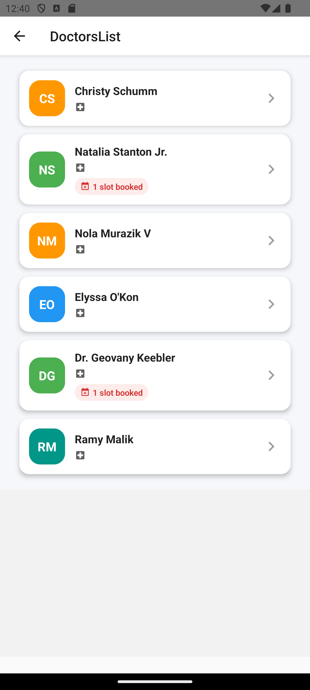
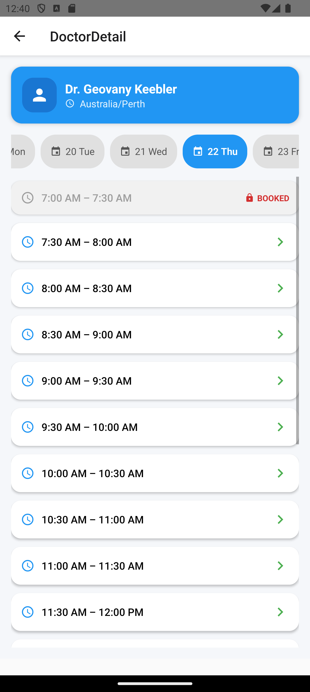
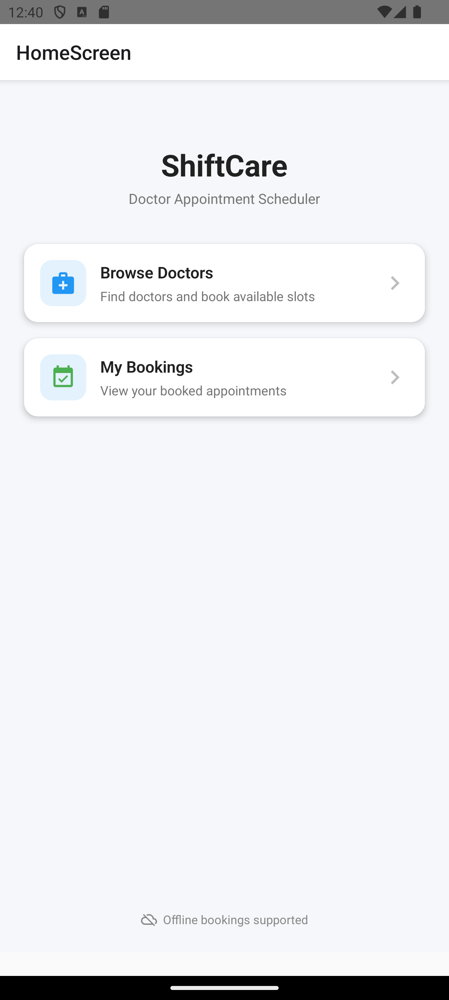
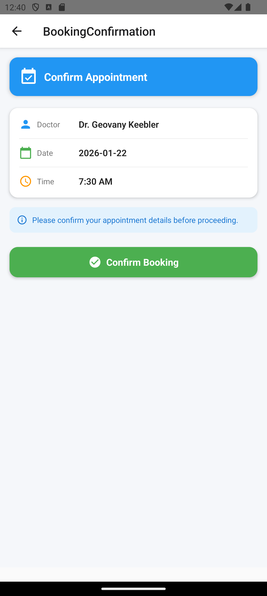
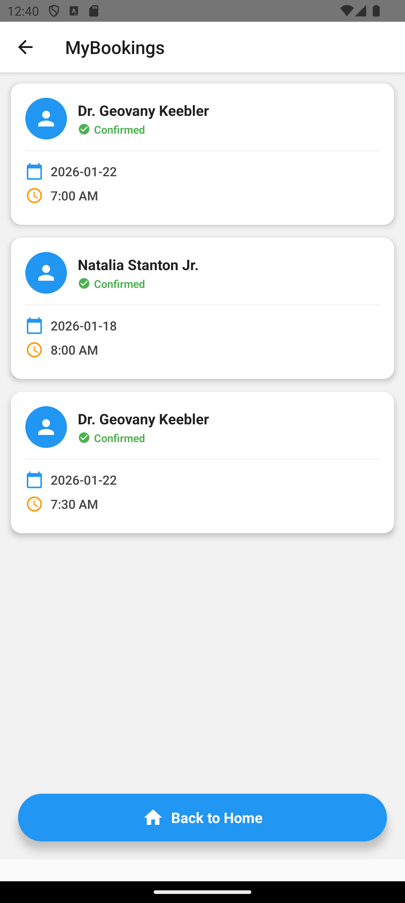

# Doctor Appointment Booking App (React Native)

A modern **Doctor Appointment Booking** mobile application built with **React Native**, **TypeScript**, **Redux Toolkit**, and **Material Design Icons**.  
The app allows users to browse doctors, select available dates and time slots, confirm appointments, and view their bookings — with **double-booking prevention** built in.

---

## Videos (Demo)

Android: https://drive.google.com/file/d/1G94JTOsX09iKxIzYTIz74TXy1vIkzvP8/view?usp=sharing
IOS: https://drive.google.com/file/d/1uO7U6hYRhtimbzYLdwjLN_2S3XCGnzRo/view?usp=sharing

## Features

- Doctor Listing
- Doctor Detail Screen
- Date & Time Slot Selection
- Booking Confirmation Screen
- Prevents Double Booking
- My Bookings Screen
- Material UI inspired design
- Smooth UI with FlatList
- Centralized state using Redux Toolkit

---

## Screens Included

- Home / Doctor List
- Doctor Details
- Date Selector (Horizontal Scroll)
- Booking Confirmation
- My Bookings
- Empty Booking State

---

### App Preview

| Doctor List                      | Doctor Details                     | Home Screen               |
| -------------------------------- | ---------------------------------- | ------------------------- |
|  |  |  |

| Booking Confirmation                      | My Bookings                      |
| ----------------------------------------- | -------------------------------- |
|  |  |

---

## Tech Stack

- **React Native**
- **TypeScript**
- **Redux Toolkit**
- **React Navigation (Native Stack)**
- **Material Icons**
- **UUID**


---

## Future Enhancements

- Cancel Booking
- Push Notifications
- User Profiles
- Backend API Integration
- Payments
- Doctor Reviews & Ratings

## Project Structure

```plaintext
src/
│
├── components/
│   └──DoctorCard.tsx
│
├── navigation/
│   └── AppNavigator.tsx
│
├── hooks/
│   └── useBookingsPersistence.ts
│
├── navigation/
│   └── AuthContext.tsx
│
├── screens/
│   ├── BookingConfirmationScreen.tsx
│   ├── DoctorDetailScreen.tsx
│   └── DoctorsListScreen.tsx
│   └── HomeScreen.tsx
│   └── MyBookingsScreen.tsx
│
├── store/
│   ├── bookingsSlice.ts
│   ├── doctorsSlice.ts
│   └── hooks.ts
│   └── index.ts
│
├── tests/
│   ├── BookingConfirmationScreen.test.tsx
│   └── DoctorCard.test.tsx
│   └── DoctorDetailScreen.test.tsx
│   └── MyBookingsScreen.test.tsx
│
├── types/
│   └── index.ts
│
├── utils/
│   ├── dates.ts
│   ├── slotGenerator.ts
│   └── DoctorsListScreen.tsx
│   └── storage.ts
│   └── transformDoctors.ts
│
└── App.tsx

```

## Setup

# Getting Started

> **Note**: Make sure you have completed the [Set Up Your Environment](https://reactnative.dev/docs/set-up-your-environment) guide before proceeding.

## Step 1: Start Metro

First, you will need to run **Metro**, the JavaScript build tool for React Native.

To start the Metro dev server, run the following command from the root of your React Native project:

```sh
# Using npm
npm start

# OR using Yarn
yarn start
```

## Step 2: Build and run your app

With Metro running, open a new terminal window/pane from the root of your React Native project, and use one of the following commands to build and run your Android or iOS app:

### Android

```sh
# Using npm
npm run android

# OR using Yarn
yarn android
```

### iOS

For iOS, remember to install CocoaPods dependencies (this only needs to be run on first clone or after updating native deps).

The first time you create a new project, run the Ruby bundler to install CocoaPods itself:

```sh
bundle install
```

Then, and every time you update your native dependencies, run:

```sh
bundle exec pod install
```

For more information, please visit [CocoaPods Getting Started guide](https://guides.cocoapods.org/using/getting-started.html).

```sh
# Using npm
npm run ios

# OR using Yarn
```
